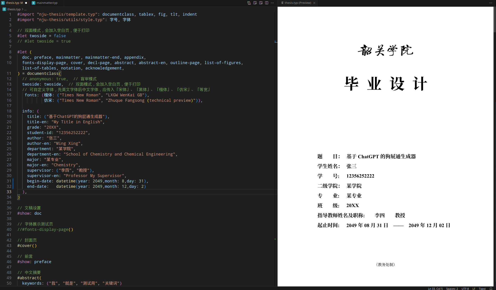

# 韶关学院学位论文模板 sgu-thesis-typst

韶关学院学位论文 （设计）的 Typst 模板，能够简洁、快速、持续生成 PDF 格式的毕业论文。

源自[南京大学学位论文](https://github.com/nju-lug/nju-thesis-typst).

详细说明请见原始项目



## 劣势

- Typst 是一门新生的排版标记语言，还做不到像 Word 或 LaTeX 一样成熟稳定。


## 优势

Typst 是可用于出版的可编程标记语言，拥有变量、函数与包管理等现代编程语言的特性，注重于科学写作 (science writing)，定位与 LaTeX 相似。可以阅读原作者的 [一篇知乎文章](https://zhuanlan.zhihu.com/p/669097092) 进一步了解 Typst 的优势。

- **语法简洁**：上手难度跟 Markdown 相当，文本源码阅读性高，不会像 LaTeX 一样充斥着反斜杠与花括号。
- **编译速度快**：Typst 使用 Rust 语言编写，即 typ(e+ru)st，目标运行平台是WASM，即浏览器本地离线运行；也可以编译成命令行工具，采用一种 **增量编译** 算法和一种有约束的版面缓存方案，**文档长度基本不会影响编译速度，且编译速度与常见 Markdown 渲染引擎渲染速度相当**。
- **环境搭建简单**：不需要像 LaTeX 一样折腾几个 G 的开发环境，原生支持中日韩等非拉丁语言，无论是官方 Web App 在线编辑，还是使用 VS Code 安装插件本地开发，都是 **即开即用**。
- **现代编程语言**：Typst 是可用于出版的可编程标记语言，拥有 **变量、函数、包管理与错误检查** 等现代编程语言的特性，同时也提供了 **闭包** 等特性，便于进行 **函数式编程**。以及包括了 `[标记模式]`、`{脚本模式}` 与 `$数学模式$` 等多种模式的作用域，并且它们可以不限深度地、交互地嵌套。并且通过 **包管理**，你不再需要像 TexLive 一样在本地安装一大堆并不必要的宏包，而是 **按需自动从云端下载**。

可以参考 [Typst 中文文档网站](https://typst-doc-cn.github.io/docs/) 迅速入门。


## 使用

快速浏览效果: 查看 [thesis.pdf](https://github.com/FurryAcetylCoA/sgu-thesis-typst/blob/main/thesis.pdf)，样例论文源码：查看 [thesis.typ](https://github.com/FurryAcetylCoA/sgu-thesis-typst/blob/main/thesis.typ)

**你只需要修改根目录下的 `thesis.typ` 文件即可，基本可以满足你的所有需求，`nju-thesis` 目录下的代码可以用于参数查阅，但是理论上你不应该对其进行更改。**

Fork作者注：我已经按照`韶关学院毕业论文（设计）基本规范`修改过里面的东西了

如果你认为不能满足你的需求，可以先查阅后面的 [Q&A](#Q%26A) 部分。

### 在线编辑

请见原始项目[文档](https://github.com/FurryAcetylCoA/sgu-thesis-typst?tab=readme-ov-file#%E5%9C%A8%E7%BA%BF%E7%BC%96%E8%BE%91)


### 本地编辑（推荐）

1. 克隆本项目，或者直接通过绿色的Code按钮-> Download zip下载然后解压。
2. 在 [VS Code](https://code.visualstudio.com/) 中打开该目录。
3. 在 VS Code 中安装 [Typst LSP](https://marketplace.visualstudio.com/items?itemName=nvarner.typst-lsp) 和 [Typst Preview](https://marketplace.visualstudio.com/items?itemName=mgt19937.typst-preview) 插件。前者负责语法高亮和错误检查，后者负责预览。
    - 也推荐下载 [Typst Companion](https://marketplace.visualstudio.com/items?itemName=CalebFiggers.typst-companion) 插件，其提供了例如 `Ctrl + B` 进行加粗等便捷的快捷键。
    - 你还可以下载 [Typst Sync](https://marketplace.visualstudio.com/items?itemName=OrangeX4.vscode-typst-sync) 和 [Typst Sympy Calculator](https://marketplace.visualstudio.com/items?itemName=OrangeX4.vscode-typst-sympy-calculator) 插件，前者提供了本地包的云同步功能，后者提供了基于 Typst 语法的科学计算器功能。
4. 按下 `Shift + Ctrl + P`，然后输入命令 `Typst Preview: Preview current file`，即可 **同步增量渲染与预览**，还提供了 **光标双向定位功能**。


### 特性 / 路线图

- **说明文档**
    - [ ] 编写更详细的说明文档，后续考虑使用 [tidy](https://github.com/typst/packages/tree/main/packages/preview/tidy/0.1.0) 编写，你现在可以先参考 [NJUThesis](https://mirror-hk.koddos.net/CTAN/macros/unicodetex/latex/njuthesis/njuthesis.pdf) 的文档，参数大体保持一致，或者直接查阅对应源码函数的参数
- **类型检查**
    - [ ] 应该对所有函数入参进行类型检查，及时报错
- **全局配置**
    - [x] 类似 LaTeX 中的 `documentclass` 的全局信息配置
    - [x] **盲审模式**，将个人信息替换成小黑条，并且隐藏致谢页面，论文提交阶段使用 
    - [x] **双面模式**，会加入空白页，便于打印
    - [x] **自定义字体配置**，可以配置「宋体」、「黑体」与「楷体」等字体对应的具体字体
        - [ ] **字体解耦合**：将字体配置进一步解耦合，让用到字体的地方加上一层字体名称配置项（从「标题（宋体）」-「具体字体」重构为「标题」-「宋体」-「具体字体」）
    - [x] **数学字体配置**：模板不提供配置，用户可以自己使用 `#show math.equation: set text(font: "Fira Math")` 更改
- **模板**
  - [x] 本科生模板
    - [x] 字体测试页
    - [x] 封面
    - [x] 声明页
    - [x] 中文摘要
    - [x] 英文摘要
    - [x] 目录页
    - [x] 插图目录
    - [x] 表格目录
    - [x] 符号表
    - [x] 致谢
  - [x] 研究生模板
    - [x] 封面 
    - [x] 声明页 
    - [x] 摘要
    - [x] 页眉 
    - [ ] 国家图书馆封面
    - [ ] 出版授权书
  - [ ] 博士后模板
- **编号**
    - [x] 前言使用罗马数字编号
    - [x] 附录使用罗马数字编号
    - [x] 表格使用 `1.1` 格式进行编号
    - [x] 数学公式使用 `(1.1)` 格式进行编号
- **环境**
    - [ ] 定理环境（这个也可以自己使用第三方包配置）
- **其他文件**
    - [x] 本科生开题报告
    - [x] 研究生开题报告


## Q&A

### 我不会 LaTeX，可以用这个模板写论文吗？

可以。

如果你不关注模板的具体实现原理，你可以用 Markdown Like 的语法进行编写，只需要按照模板的结构编写即可。


### 我不会编程，可以用这个模板写论文吗？

同样可以。

只需打开`thesis.typ`，翻到中间，照葫芦画瓢即可


### 为什么我的字体没有显示出来，而是一个个「豆腐块」？

这是因为本地没有对应的字体，**这种情况经常发生在 MacOS 的「楷体」显示上**。

你应该安装本目录下的 `fonts` 里的所有字体，里面包含了可以免费商用的「方正楷体」和「方正仿宋」，然后再重新渲染测试即可。

你可以使用 `#fonts-display-page()` 显示一个字体渲染测试页面，查看对应的字体是否显示成功。

如果还是不能成功，你可以按照模板里的说明自行配置字体，例如

```typst
#let (...) = documentclass(
  fonts: (楷体: ("Times New Roman", "FZKai-Z03S")),
)
```

先是填写英文字体，然后再填写你需要的「楷体」中文字体。

**字体名称可以通过 `typst fonts` 命令查询。**

如果找不到你所需要的字体，可能是因为 **该字体变体（Variants）数量过少**，导致 Typst 无法识别到该中文字体。


### 为什么楷体无法加粗？

因为一般默认安装的「楷体」只有标准字重的字体，没有加粗版本的字体（华文粗楷等字体并不是免费商用的），而 Typst 又没有实现伪粗体（Fake Bold）算法，所以导致无法正常加粗。

目前还没找到一个比较好的解决方法。


### 学习 Typst 需要多久？

一般而言，仅仅进行简单的编写，不关注布局的话，你可以打开模板就开始写了。

如果你想进一步学习 Typst 的语法，例如如何排篇布局，如何设置页脚页眉等，一般只需要几个小时就能学会。

如果你还想学习 Typst 的「[元信息](https://typst-doc-cn.github.io/docs/reference/meta/)」部分，进而能够编写自己的模板，一般而言需要几天的时间阅读文档，以及他人编写的模板代码。

如果你有 Python 或 JavaScript 等脚本语言的编写经验，了解过函数式编程、宏、样式、组件化开发等概念，入门速度会快很多。


### 我有编写 LaTeX 的经验，如何快速入门？

可以参考 [面向 LaTeX 用户的 Typst 入门指南](https://typst-doc-cn.github.io/docs/guides/guide-for-latex-users/)。


### 目前 Typst 有哪些第三方包和模板？

可以参考 [第三方包](https://typst-doc-cn.github.io/docs/packages/)和[Awesome Typst Links](https://github.com/qjcg/awesome-typst)。

### 我如何更改页面上的样式？具体的语法是怎么样的？

请见原始项目[文档](https://github.com/FurryAcetylCoA/sgu-thesis-typst?tab=readme-ov-file


### 该模板和其他现存 Typst 中文论文模板的区别？

其他现存的 Typst 中文论文模板大多都是在 2023 年 7 月份之前（Typst Verison 0.6 之前）开发的，当时 Typst 还不不够成熟，甚至连 **包管理** 功能都还没有，因此当时的 Typst 中文论文模板的开发者基本都是自己从头写了一遍需要的功能/函数，因此造成了 **代码耦合度高**、**意大利面条式代码**、**重复造轮子** 与 **难以自定义样式** 等问题。

该模板是在 2023 年 10 ～ 11 月份（Typst Verison 0.9 时）开发的，此时 Typst 语法基本稳定，并且提供了 **包管理** 功能，因此能够减少很多不必要的代码。

并且模板的文件架构进行了解耦，主要分为了 `utils`、`templates` 和 `layouts` 三个目录，这三个目录可以看后文的开发者指南，并且使用 **闭包** 特性实现了类似不可变全局变量的全局配置能力，即模板中的 `documentclass` 函数类。


## 开发者指南

### 外部目录

- `thesis.typ` 文件: 你的论文源文件，可以随意更改这个文件的名字，甚至你可以将这个文件在同级目录下复制多份，维持多个版本。
- `bibs` 目录: 放置参考文献的目录。
- `nju-thesis` 目录: 模板目录，放置模板的所有内容，**这个目录可以作为一个 Local Package 安装到本地包目录**，因此理论上你不应该修改这个目录下的任何东西。


### 内部目录

- `utils` 目录: 包含了模板使用到的各种自定义辅助函数，存放没有外部依赖，且 **不会渲染出页面的函数**。
- `templates` 目录: 包含了模板用到的各个 **独立页面**，例如封面页、声明页、摘要等，即 **会渲染出不影响其他页面的独立页面的函数**。
- `layouts` 目录: 布局目录，存放着用于排篇布局的、应用于 `show` 指令的、**横跨多个页面的函数**，例如为了给页脚进行罗马数字编码的前言 `preface` 函数。
  - 主要分成了 `doc` 文稿、`preface` 前言、`mainmatter` 正文与 `appendix` 附录/后记。
- `template.typ`:
  - **职责一**: 作为一个统一的对外接口，暴露出内部的 utils 函数，例如三线表 `tlt` 函数。
  - **职责二**: 使用 **函数闭包** 特性，通过 `documentclass` 函数类进行全局信息配置，然后暴露出拥有了全局配置的、具体的 `layouts` 和 `templates` 内部函数。


## 参与贡献

- 在 Issues 中提出你的想法，如果是新特性，可以加入路线图！
- 实现路线图中仍未实现的部分，然后欢迎提出你的 PR。
- 欢迎 **将这个模板迁移至你的学校论文模板**，大家一起搭建更好的 Typst 社区和生态吧。


## 致谢

- 感谢 [@atxy-blip](https://github.com/atxy-blip) 开发的 [NJUThesis](https://github.com/nju-lug/NJUThesis) LaTeX 模板，文档十分详细，本模板大体结构都是参考 NJUThesis 的文档开发的。
- 感谢 [HUST-typst-template](https://github.com/werifu/HUST-typst-template) 与 [sysu-thesis-typst](https://github.com/howardlau1999/sysu-thesis-typst) 等 Typst 中文论文模板。

## TODO

表格的标题好像还有点问题


## License

This project is licensed under the MIT License.
